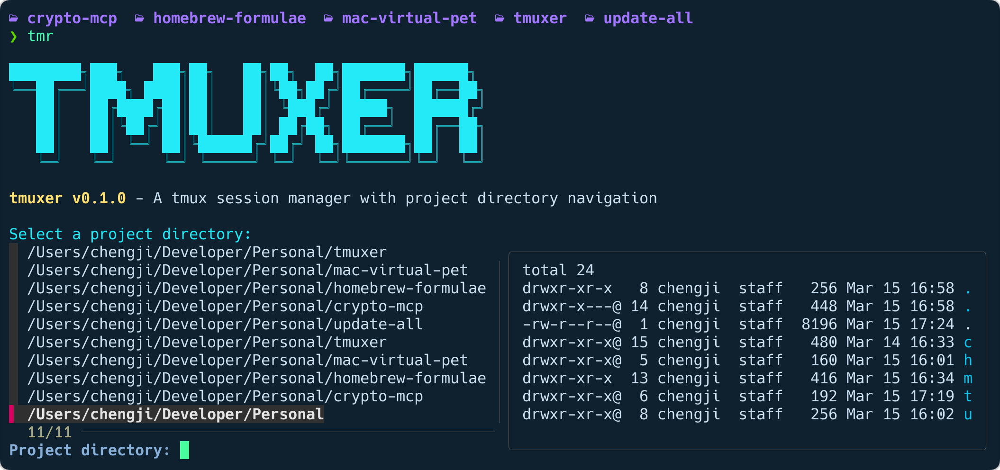

# tmuxer

A tmux session starter to quickly launch your personal and work projects with predefined layouts.

```
████████╗███╗   ███╗██╗   ██╗██╗  ██╗███████╗██████╗
╚══██╔══╝████╗ ████║██║   ██║╚██╗██╔╝██╔════╝██╔══██╗
   ██║   ██╔████╔██║██║   ██║ ╚███╔╝ █████╗  ██████╔╝
   ██║   ██║╚██╔╝██║██║   ██║ ██╔██╗ ██╔══╝  ██╔══██╗
   ██║   ██║ ╚═╝ ██║╚██████╔╝██╔╝ ██╗███████╗██║  ██║
   ╚═╝   ╚═╝     ╚═╝ ╚═════╝ ╚═╝  ╚═╝╚══════╝╚═╝  ╚═╝
```

**tmuxer** is a bash script that simplifies tmux session management and project navigation. It allows you to quickly create, attach to, and manage tmux sessions with predefined layouts for different workflows. Based on ThePrimeagen's [tmux-sessionizer](https://github.com/ThePrimeagen/.dotfiles/blob/master/bin/.local/scripts/tmux-sessionizer)



## Quick Start

### Option 1: Homebrew (recommended)

```bash
brew tap szcharlesji/formulae
brew install tmuxer
```

### Option 2: Manual Installation

1. Clone the repository:

```bash
git clone https://github.com/szcharles/tmuxer.git
cd tmuxer
```

2. Make the script executable:

```bash
chmod +x tmuxer.sh
```

3. Create a symbolic link to make it available system-wide:

```bash
sudo ln -s "$(pwd)/tmuxer.sh" /usr/local/bin/tmuxer
sudo ln -s "$(pwd)/tmuxer.sh" /usr/local/bin/tmr  # Optional alias
```

## Usage

### Basic Commands

- **Start tmuxer**:

    ```bash
    tmr
    ```

- **Start tmuxer with a specific directory**:

    ```bash
    tmr ~/projects/my-project
    ```

- **List existing sessions**:

    ```bash
    tmr -l
    # or
    tmr --list
    ```

- **Attach to an existing session**:

    ```bash
    tmr -a
    # or
    tmr --attach
    ```

- **Kill a specific session**:
    ```bash
    tmr -k session-name
    # or
    tmr --kill session-name
    ```

### Command-line Options

| Option  | Long Option | Description                                      |
| ------- | ----------- | ------------------------------------------------ |
| -h      | --help      | Display help message                             |
| -v      | --version   | Display version information                      |
| -l      | --list      | List existing tmux sessions                      |
| -k NAME | --kill NAME | Kill the specified tmux session                  |
| -a      | --attach    | List and attach to existing tmux sessions        |
|         | --code      | Use code layout (single pane with editor)        |
|         | --dev       | Use development layout (editor + terminal split) |
|         | --terminal  | Use terminal layout (just terminal, no editor)   |

You can also use the shorthand alias `tmr` instead of `tmuxer` for all commands.

### Session Layouts

tmuxer supports three different session layouts:

1. **Dev Layout** (default):

    - Main editor pane (nvim) occupying most of the screen
    - Two terminal panes at the bottom split horizontally
    - Ideal for development workflows

2. **Code Layout**:

    - Single pane with editor (nvim)
    - Focused environment for coding

3. **Terminal Layout**:
    - Just a terminal session without launching an editor
    - Useful for server management or command-line tasks

Examples:

```bash
tmuxer --dev ~/projects/my-app      # Create a dev layout session
tmuxer --code ~/projects/my-library  # Create a code layout session
tmuxer --terminal ~/servers          # Create a terminal layout session
```

## Configuration

tmuxer uses a configuration file located at `~/.tmuxer.conf` to store project root directories. Each line in this file represents a directory that will be included in the fuzzy search when selecting a project.

A default configuration file will be created automatically the first time you run tmuxer. You can edit it to add your own project directories:

```bash
# tmuxer configuration file
# Add project directories below, one per line
~/projects
~/work/repos
~/personal/websites
```

When you run tmuxer without specifying a directory, it will:

1. Include subdirectories of your current directory
2. Include subdirectories of all directories in your config file
3. Allow you to select from this list using fzf

## Examples

### Basic Workflow

```bash
# Navigate to your workspace
cd ~/workspace

# Launch tmuxer and select a project interactively
tmuxer

# tmuxer will present a fuzzy finder for you to select a project
# Once selected, it will create or attach to a session with the default layout
```

### Advanced Examples

```bash
# Start a coding session for a specific project with code layout
tmr --code ~/projects/react-app

# List all existing sessions
tmr -l

# Kill a specific session
tmr -k my_session_name

# Attach to an existing session (interactive selection)
tmr -a
```

## Customization

### Modifying Session Layouts

You can customize the default session layouts by editing the `create_tmux_session` function in the tmuxer script. The layouts are defined in case statements based on the layout name.

### Adding New Layouts

To add a new layout:

1. Open the tmuxer script in your editor
2. Locate the `create_tmux_session` function
3. Add a new case in the case statement for your layout
4. Update the command-line options parsing to accept your new layout option

### Changing Default Editor

tmuxer uses nvim as the default editor. To change this:

1. Open the tmuxer script
2. Find all instances of `nvim`
3. Replace with your preferred editor (e.g., `vim`, `emacs`, `code -w`)

---

Created by [szcharles](https://github.com/szcharles)
